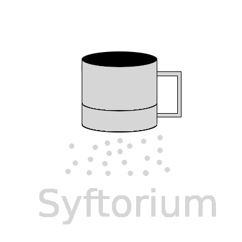

# lmsyft



Welcome to the Syftorium!

The Syftorium is a collection of specimen-based analytics assessing the composition of
collection holdings and available species information. These data are used to compare
and assess collections against and among the collective holdings of all of the world's
data that we can get our hands on.  This information is then made available back to the
institutions and others so that it can assist those collections in prioritizing
collecting and digitization efforts, institutional loans, mergers, deaccessions, et
cetera in order to improve, or show off, the overall quality of the collection.  This
information can also be used by the community as a whole to identify gaps in species
knowlege and redundancies for similar motivations.  The Syftorium presents this
information in multivariate-, but subsettable, space in order to create the most
compelling picture of the data as possible in order to provide as much value and
feedback to the community as we can.

## Using the Syftorium

Syftorium web services are documented using the
[Open API 3 spec](https://swagger.io/specification/).  The raw documentation can be
found at [/docs/openapi.yml](/docs/openapi.yml) and a version rendered with Swagger can
be found at https://lifemapper.github.io/lmsyft/.

## Deployment

To run the containers, generate `fullchain.pem` and `privkey.pem` (certificate
and the private key) using Let's Encrypt and put these files into the
`./lmtrex/config/` directory.

While in development, you can generate self-signed certificates:

```zsh
openssl req \
  -x509 -sha256 -nodes -newkey rsa:2048 -days 365 \
  -keyout ./config/privkey.pem \
  -out ./config/fullchain.pem
```

To run the production container, or the development container with HTTPs
support, generate `fullchain.pem` and `privkey.pem` (certificate and the private
key) using Let's Encrypt and put these files into the `./config/`
directory.

### Production

Modify the `FQDN` environment variable in `.env.conf` as needed.

Run the containers:

```zsh
docker compose up -d
```

lmsyft is now available at [https://localhost/](https://localhost:443)

#### Process DWCAs

You can setup a cron job to process pending DWCAs.

See `./cron/lmsyft_process_dwcas_cron.in`.

Note, you many need to modify `lmsyft-sp_cache-1` to reflect your container
name.

### Development

Run the containers:

```zsh
docker compose -f docker-compose.yml -f docker-compose.development.yml up
```

lmsyft is now available at [http://localhost/](http://localhost:443).

Flask has hot-reload enabled.

#### Configuring Debugger

Debugger configuration is IDE dependent. [Instructions for
PyCharm](https://kartoza.com/en/blog/using-docker-compose-based-python-interpreter-in-pycharm/)

`runner` container is running `debugpy` on port `5001` and `sp_cache` on
port `5002`.